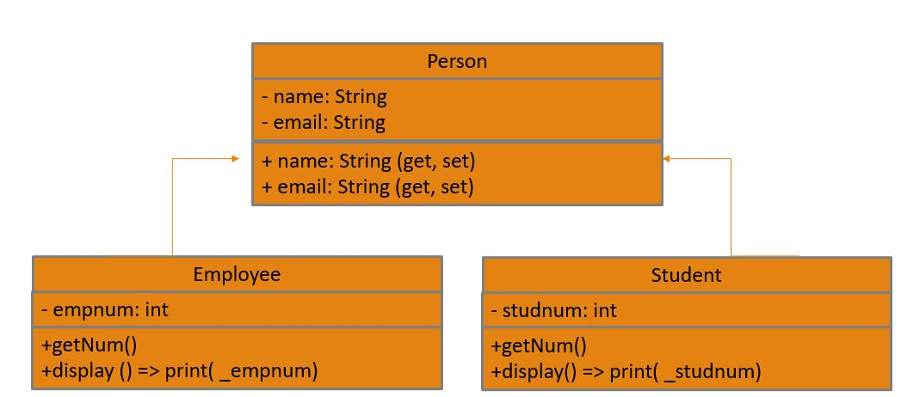

# Module 3 – Activity 5 – Person / Employee / Student (Dart)

The Module 3 capstone. Put **encapsulation**, **inheritance** and
**polymorphism** together by turning the class diagram into a small
registration-and-login program.

## The class diagram



Text version of the same diagram:

```
                 ┌──────────────────────────────┐
                 │            Person             │
                 ├──────────────────────────────┤
                 │ - name: String                │   (private)
                 │ - email: String               │
                 ├──────────────────────────────┤
                 │ + name  (get, set)            │   (public access)
                 │ + email (get, set)            │
                 └──────────────────────────────┘
                     ▲                        ▲
                     │ extends                │ extends
   ┌─────────────────────────┐   ┌─────────────────────────┐
   │        Employee         │   │         Student         │
   ├─────────────────────────┤   ├─────────────────────────┤
   │ - empnum: int           │   │ - studnum: int          │
   ├─────────────────────────┤   ├─────────────────────────┤
   │ + getNum()              │   │ + getNum()              │
   │ + display()             │   │ + display()             │
   └─────────────────────────┘   └─────────────────────────┘
```

`Person` holds the shared data (name, email) privately and exposes it with
getters/setters. `Employee` and `Student` **extend** `Person`, each adding its
own number and its own `getNum()` / `display()`. Because both *are* a `Person`,
one loop can treat them the same way and still get each one's own behaviour
(**polymorphism**).

`Person` itself is **abstract**: you never make a plain `Person`, only an
`Employee` or a `Student`. It declares `getNum()` and `display()` without bodies,
so every subclass is required to provide its own. That shared promise is exactly
what lets one `List<Person>` hold both kinds and call the right version of each.

## What to do

### 1. Fill in your details

Open `student.json` and fill in every field (use the **class code** your
instructor gave you):

```json
{
  "classCode": "1234",
  "fullName": "Juan Dela Cruz",
  "studentNumber": "2026-12345",
  "studentEmail": "juan.delacruz@hau.edu.ph",
  "personalEmail": "juan@example.com",
  "githubAccount": "juandelacruz"
}
```

> **Keep `student.json` identical across all your activities.** The autograder
> cross-checks these fields between your repos, and a mismatch (e.g. a different
> `classCode` in one activity) is flagged. The `classCode` must also match the
> one in your repo name.

### 2. Write the classes

Open [`bin/people.dart`](bin/people.dart) and build this API:

| Member | What it does |
| --- | --- |
| `Person(name, email)` | base class; stores name and email in **private** fields |
| `name`, `email` | get/set the private fields |
| `getNum()` | each subclass returns its own number |
| `display()` | each subclass returns text including the number, name and email |
| `Employee(empnum, name, email)` | extends `Person`; adds a private `empnum` |
| `Student(studnum, name, email)` | extends `Person`; adds a private `studnum` |
| `generatePassword()` | returns a random **10-character** password of uppercase letters, lowercase letters and digits |

### 3. Write the program (`main`)

Build this flow:

1. Ask the user to register, choosing a category: **Employee** or **Student**.
   - If **employee** → input employee number, name, and email.
   - If **student** → input student number, name, and email.
   - If the category is **neither**, end the program.
2. **Display the entry details**, and generate a **temporary password** for
   initial access (the 10-character one). Sample output:

   ```
   Your student number: 1111
   Welcome Bing Chua
   You register bchua@haustudent.edu.ph as your username
   ```
   ```
   Your Employee number: 5555
   Welcome Everly Chua
   You register echua@hau.edu.ph as your username
   ```
3. Ask the user to **log in** with the registered username (email) and the
   temporary password. On success, ask them to **change their password**.

> **Bonus (up to 10 points):** sensible enhancements to the basic requirements
> are rewarded - for example input validation, password-strength rules, masking
> input, or a cleaner menu. Build the basics first.

> **Concepts to research** - see the **Module 3 – OOP** cheat sheet
> (`content/cheat-sheets/dart-m3-oop.md`): encapsulation, `extends`/`super`,
> `@override`, and polymorphism; and the **Functions & Randomness** cheat sheet
> (`content/cheat-sheets/dart-m3-functions-and-random.md`) for the random
> temporary password.

Run it yourself:

```bash
dart run bin/people.dart
```

## Set up your repo

Before you write any code, create **your own copy** of this activity from the
template. Do not work in the template itself.

1. **Create from the template.** Open the template repo and click
   **Use this template → Create a new repository**.
2. **Set the owner to the course org.** Under *Owner*, choose the **`HAU-6ADET`
   course org**, **not** your personal account.
3. **Name it by the convention** `m<module>a<activity>-<classcode>-<yourname>`.
   For this activity that's **`m3a5-<classcode>-yourname`** (e.g.
   `m3a5-1234-juandelacruz`). The `<classcode>` must match the one you put in
   `student.json`.
4. **Make it Private.** Set *Visibility* to **Private** so classmates can't see
   your work.

Then clone **your** new repo and work there:

```bash
git clone https://github.com/HAU-6ADET/m3a5-<classcode>-yourname.git
cd m3a5-<classcode>-yourname
```

## Running the tests

```bash
dart pub get
dart test
```

This activity is graded by **6 tests** (1 point each). They check:

- ✅ `student.json` is completely filled in (1 test)
- ✅ the inherited `name`/`email` getters and setters work (1 test)
- ✅ an `Employee` is a `Person` and reports its employee number (1 test)
- ✅ a `Student` is a `Person` and reports its student number (1 test)
- ✅ polymorphism: the same call runs each subclass's own `getNum()`/`display()` (1 test)
- ✅ `generatePassword()` makes a random 10-character alphanumeric string (1 test)

The tests grade the **classes** and the password generator; the registration and
login flow in `main()` is for you to run and try (and where the bonus lives).
Each part is graded independently, so you earn partial credit.

## Confirm your submission

Your repo **is** your submission, so there is nothing to upload anywhere. When the
tests pass locally, **commit and push** so your work is recorded:

```bash
git add -A
git commit -m "Activity 5 complete"
git push
```

Pushing triggers the **Autograde** workflow. Confirm your submission landed:

1. Open your repo on GitHub and click the **Actions** tab.
2. Open the latest **Autograde** run and confirm the green ✅ check
   and the "6 / 6 tests passed" summary.
